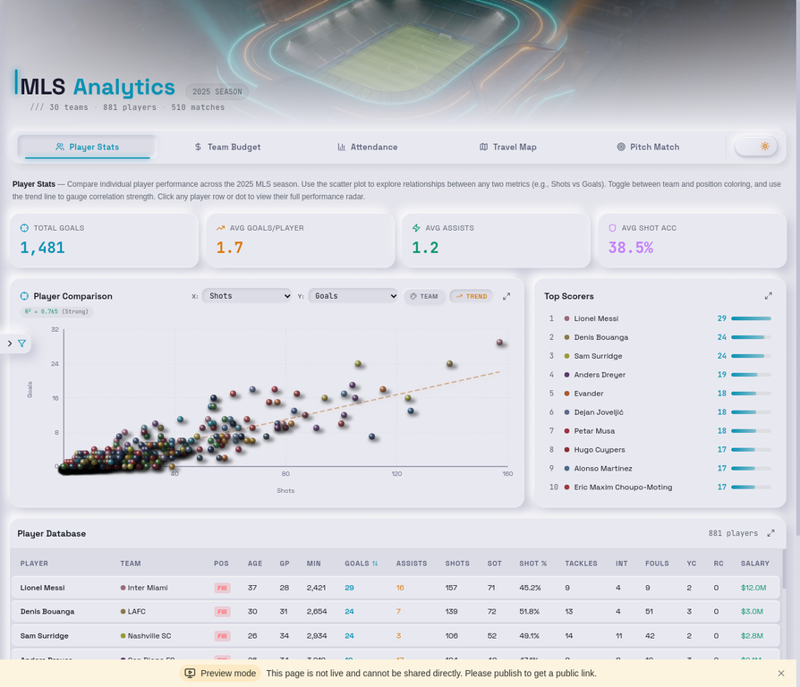
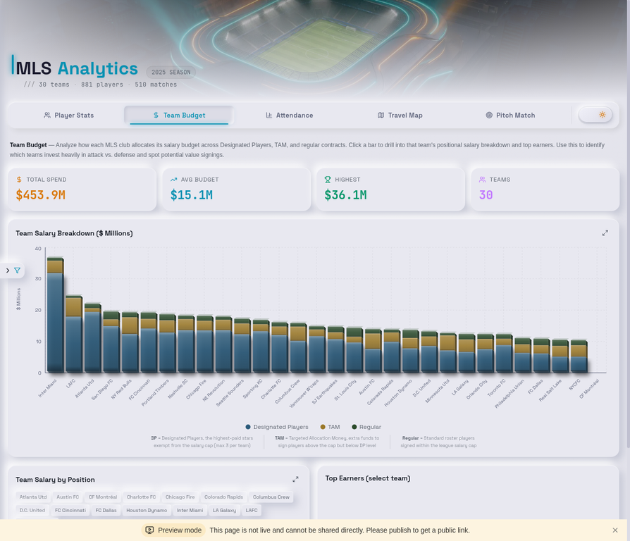
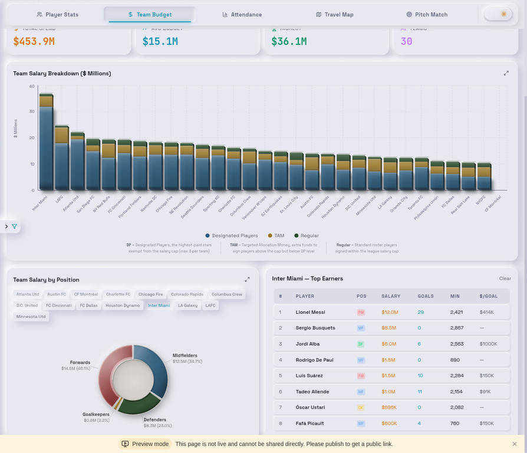
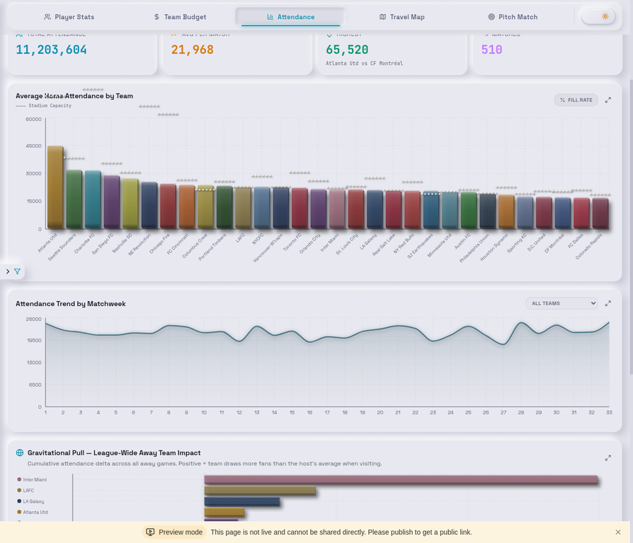
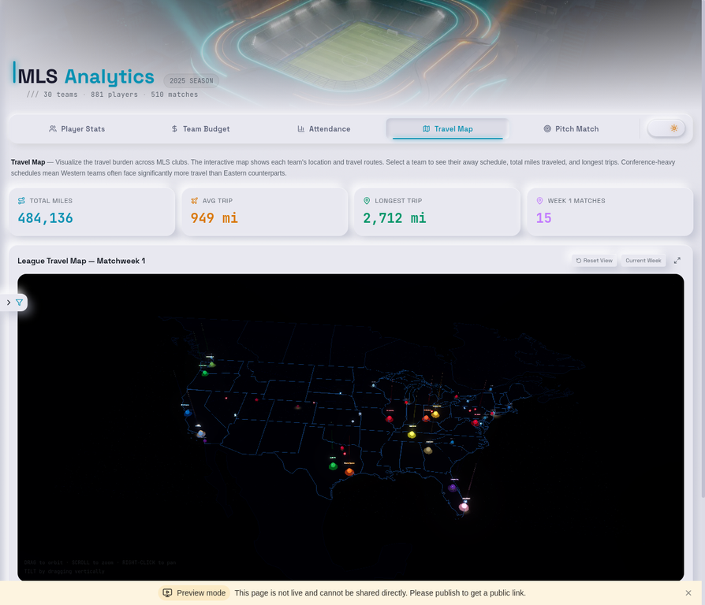
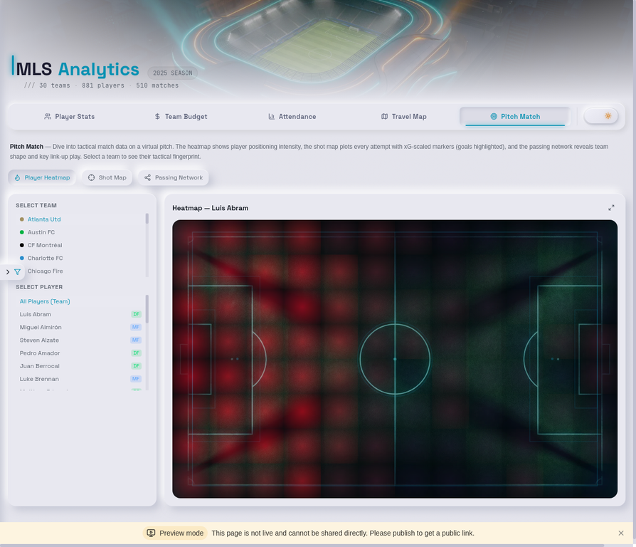

# MLS Analytics Dashboard

An advanced interactive dashboard for Major League Soccer statistical analysis featuring the live 2026 season and complete 2025 historical data. Built with React 19, Tailwind CSS 4, Recharts, and Three.js, the dashboard showcases a custom **Industrial Neumorphic 3D** design system with extruded chart elements, gradient lighting, cast shadows, and glassmorphic overlays.



---

## Features

The dashboard is organized into six core analytical tabs:

### 1. Season Pulse
A unified timeline of the season's unfolding narrative.
- **Snapshot Table:** A 30-team standings matrix ranked by a composite Power Score (points, form, goal difference, momentum).
- **Rank Flow Bump Chart:** A custom SVG visualization showing how teams rise and fall across matchweeks.
- **Storyline Detection:** The Insight Engine auto-detects streaks, collapses, and surges (e.g., "The LAFC Wall: 5 games, 0 goals conceded").

### 2. Player Stats
Compare individual player performance across the MLS season. The scatter plot lets you explore relationships between any two metrics (Shots vs Goals, Minutes vs Assists, etc.) with team or position coloring and a trend line showing correlation strength. Click any player row or dot to view their full performance radar. Includes a sortable, filterable database of all 881 players across 17 statistical columns.

### 3. Team Budget
Analyze how each MLS club allocates its salary budget across Designated Players, TAM, and regular contracts. Click any team bar to drill into positional salary breakdowns (via a 3D neumorphic donut chart) and see top earners with cost-per-goal efficiency metrics.





### 4. Attendance
Explore match-day attendance across all MLS venues. The bar chart ranks teams by average home attendance with 3D braille-dot stadium capacity markers. Toggle to fill rate mode to see stadium utilization. The trend chart tracks weekly patterns.



The Gravitational Pull section reveals how specific away teams affect host venue turnout.


### 5. Travel Performance
Visualize the travel burden across MLS clubs on an interactive 3D globe built with Three.js. Each team's stadium appears as a glowing orb, and animated arcs trace away-game routes week by week. Scrub through the season timeline to watch travel patterns unfold. Conference-heavy schedules mean Western teams often face significantly more travel than Eastern counterparts.



### 6. Pitch Match
Dive into tactical match data on a virtual pitch. The heatmap shows player positioning intensity, the shot map plots every attempt with xG-scaled markers (goals highlighted), and the passing network reveals team shape and link-up play using cinematic 3D glass nodes and neon tube conduits. Select any team to see their tactical fingerprint.



---

## The Insight Engine

This is not just a dashboard of charts; it is a data journalism product. The proprietary **Insight Engine** (`insightEngine.ts`) continuously scans the data layer to generate contextual, human-readable insights. Every chart is wrapped in a `ChartHeader` component that includes an editorial hook (e.g., "Busquets touched the ball more than anyone, but Redondo was the bridge") and an expandable METHODS panel detailing the underlying math.

---

## Data Architecture

The dashboard operates entirely without a backend database, using a hybrid data approach:

1. **Static 2025 Core:** The foundational dataset (881 players, 510 matches, real MLSPA wages) is embedded directly in a highly optimized TypeScript file (`mlsData.ts`), ensuring instant load times.
2. **Live 2026 Integration:** A Python pipeline (`scripts/fetch_2026_season.py`) pulls live match and xG data from the American Soccer Analysis (ASA) API, generating a lightweight JSON payload.
3. **Season Toggle:** A global context provider allows users to instantly switch the entire application state between the complete 2025 historical record and the live 2026 season.

---

## Design System

The dashboard uses a custom **"Dark Forge" Industrial Neumorphism** design language:

- **3D Extruded Charts** — Every bar, pie segment, and data marker has parallelogram side/bottom faces with 5-stop directional lighting gradients simulating a top-left light source
- **Cast Shadows** — Chart elements cast realistic drop shadows onto their environment, with both deep and ambient shadow layers
- **Neumorphic Cards** — Raised card surfaces with multi-layer box shadows creating a tactile, pressed-metal feel
- **Glassmorphic Overlays** — Frosted-glass tooltips and overlays with backdrop blur and subtle borders
- **3D Braille Dots** — Stadium capacity markers rendered as spherical dots with radial gradient lighting and cast shadow ellipses
- **Recessed Donut Floor** — The pie chart inner hole appears as a matte recessed surface with inward-cast shadows from surrounding segments
- **Theme Support** — Full light and dark mode with smooth CSS transitions (light mode default)

---

## Tech Stack

| Layer | Technology |
|---|---|
| Framework | React 19 + TypeScript |
| Styling | Tailwind CSS 4 + CSS Variables |
| Components | shadcn/ui (Radix primitives) |
| Charts | Recharts (with custom SVG shapes) |
| 3D Rendering | Three.js + React Three Fiber + Post-processing |
| Data Pipeline | Python (itscalledsoccer, rapidfuzz) |
| Routing | Wouter |
| Build | Vite 6 |
| Package Manager | pnpm |

---

## Getting Started

```bash
# Clone the repository
git clone https://github.com/Ptander01/mls-dashboard.git
cd mls-dashboard

# Install dependencies
pnpm install

# Start the development server
pnpm dev
```

The app will be available at `http://localhost:3000`.

### Refreshing 2026 Live Data
To pull the latest match results and xG metrics from the ASA API:
```bash
python3 scripts/fetch_2026_season.py
```

### Build for Production

```bash
pnpm build
```

The output lands in `dist/public/` — a fully static bundle you can deploy to any web server, CDN, or static hosting platform (Vercel, Netlify, GitHub Pages, etc.).

---

## Project Structure

```
client/
  src/
    pages/Home.tsx              — Main dashboard (single-page with tab navigation)
    components/
      tabs/
        SeasonPulse.tsx         — Power rankings, bump chart, narrative timeline
        PlayerStats.tsx         — Scatter plot, top scorers, player database
        TeamBudget.tsx          — Stacked bar chart, pie drill-down, top earners
        Attendance.tsx          — Bar chart, trend line, gravitational pull
        TravelMap.tsx           — Three.js 3D globe with animated arcs
        PitchMatch.tsx          — Heatmap, shot map, passing network
      NeuCard.tsx               — Neumorphic card wrapper
      ChartModal.tsx            — Full-screen chart expand modal
    lib/
      chartUtils.tsx            — All custom 3D chart shape components (2,200+ lines)
      insightEngine.ts          — Narrative generation and storyline detection
      mlsData.ts                — Complete 2025 MLS dataset (881 players, 510 matches)
      seasonDataLoader.ts       — Lazy loader for 2026 JSON data
    contexts/
      FilterContext.tsx          — Global filter state and season toggle
    index.css                   — Design tokens, neumorphic shadows, animations
scripts/
  fetch_2026_season.py          — ASA API data pipeline
  fetch_miami_network.py        — StatsBomb event data pipeline
```

---

## Documentation

- **`docs/HANDOFF.md`** — Comprehensive design system reference, component API documentation, known fixes, and development patterns
- **`ARCHITECTURE.md`** — Detailed guide for self-hosting outside Manus, build pipeline explanation, and deployment options
- **`docs/sprint-briefs/`** — The historical record of feature scoping and implementation plans

---

## License

This project is private and not licensed for redistribution.
